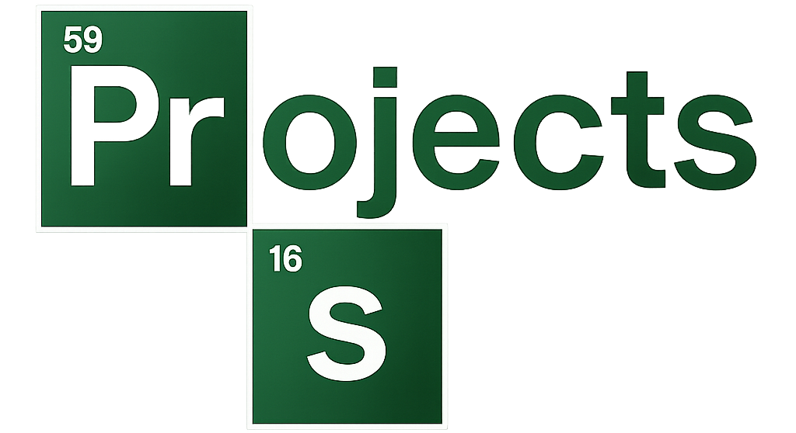

👋 Hi, I'm Samuel  
🚀 Full-Stack Developer | Web Enthusiast | Open-Source Explorer  

---

- 🔭 I’m currently working on ... **Elphast (Smart Assistant)** & **Joekar (Sales System)**  
- 🌱 I’m currently learning ... **Quantum Computing (QFT)** & **Advanced React/Node.js**  
- 👯 I’m looking to collaborate on ... **Open-Source Web Projects**  
- 🤔 I’m looking for help with ... **Quantum + Web Integration**  
- 💬 Ask me about ... **Web Development, React, Node.js, Databases**  
- 📫 How to reach me: ... samuelbannor44@gmail.com <!-- line 12: update your email -->  
- 😄 Pronouns: ... he/him  
- ⚡ Fun fact: ... I balance **web dev, AI/quantum projects, and student life** 🚀  

---

### 🛠 Tools  

  
  
  

  <!-- Programming Languages -->
  <b>💻 Programming Languages</b> 
    

  <!-- Frameworks & Libraries -->
  <b>⚡ Frameworks & Libraries</b> 
    

  <!-- Databases -->
  <b>🗄️ Databases</b> 
    

  <!-- Operating Systems -->
  <b>🖥️ Operating Systems</b> 
    

  <!-- Tools & Platforms -->
  <b>🛠️ Tools & Platforms</b> 
  

---

>[!NOTE]  
> 📝 The icons above showcase the programming languages, frameworks, tools, and platforms I've worked with throughout my journey so far — ranging from low-level languages like **C/C++**, to web technologies like **HTML, CSS, JavaScript, PHP, Node.js**, all the way to databases (**MySQL, SQLite, MongoDB**) and operating systems (**Linux distros, Windows**).  
> 🚀 They represent both my academic background and personal projects, as well as the technologies I continue to explore and grow with.

---

### 📂 Projects  
Here are some highlights from my work:  

- 🧠 **Elphast** – Smart Assistant with timetable, reminders & AI features  
- 💼 **Joekar** – Simple inventory & sales management system  
- 📅 **PalmX** – Automatic timetable generator for students  
- 🌱 **Cocoa Leaf Disease Classifier** – TensorFlow + Quantum preprocessing for agriculture  
- 🍴 **Gripson Resto** – Restaurant website with ordering & pricing system  
- ⚽ **Ultimate Football Experience** – Football-themed website with event calendar  

  

>[!TIP]
> 🌟 **Support matters!** If you find any of these projects useful or interesting, please consider giving them a **star ⭐**. Every bit of encouragement helps me keep building awesome things 🚀. Thanks for your support! 🙌

<table>
  <tr>
    <td>
      
    </td>
    <td>
      
    </td>
  </tr>
  <tr>
    <td>
      
    </td>
    <td>
      
    </td>
  </tr>
  <tr>
    <td>
      
    </td>
    <td>
      
    </td>
  </tr>
  <tr>
    <td>
      
    </td>
    <td align="center" valign="middle">
      <strong style="color:#f0f0f0; font-size: 20px;">🚧 Coming Soon!!! 🚧</strong>
    </td>
  </tr>
</table>

---

### 📊 GitHub Stats & Contributions  

  <!-- Overall Stats: Includes private commits if you enable count_private -->

  <!-- Top Languages -->

  <!-- Commit Streak -->
  

---

### 📈 Contribution Activity  

 

### 🧩 LeetCode Stats  

   <!-- line 4: replace YOUR-LEETCODE-USERNAME with your handle -->

---

<!-- Contribuciones 3D GitHub -->

<!-- Snake Animation con enlace a Platane/snk -->

<!-- Visitor Counter -->

  

### 🤝 Connect with Me  

   <!-- placeholder -->
   <!-- placeholder -->
   <!-- placeholder -->

