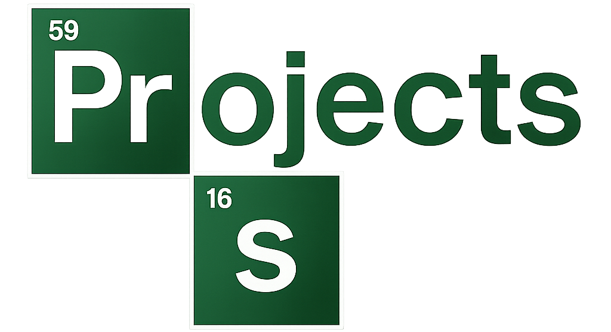

👋 Hi, I'm Samuel  
🚀 Full-Stack Developer | Web Enthusiast | Open-Source Explorer  


---

## 👨‍💻 About Me
 
```typescript
const samuel = {
  name: "Samuel Bannor-Annor",
  location: "Ghana 🇬🇭",
  role: "Full-Stack Developer | AI/Quantum Explorer",
  pronouns: "he/him",
 
  currentlyBuilding: ["Elphast (Smart AI Assistant)", "Joekar (Sales & Inventory System)"],
  currentlyLearning: ["Quantum Computing (QFT)", "Advanced React & Node.js"],
  lookingToCollaborate: "Open-Source Web Projects",
  askMeAbout: ["Web Development", "React", "Node.js", "Databases", "AI"],
 
  funFact: "I balance web dev, AI/quantum research, and student life 🚀",
  contact: "samuelbannor44@gmail.com",
};
```


---

### 🛠 Tools  
<p align="center">
  <!-- Programming Languages -->
  <b>💻 Programming Languages</b><br/>
  <br/><br/>

  <!-- Frameworks & Libraries -->
  <b>⚡ Frameworks & Libraries</b><br/>
  <br/><br/>

  <!-- Databases -->
  <b>🗄️ Databases</b><br/>
  <br/><br/>

  <!-- Operating Systems -->
  <b>🖥️ Operating Systems</b><br/>
  <br/><br/>

  <!-- Tools & Platforms -->
  <b>🛠️ Tools & Platforms</b><br/>
  
</p>

---

>[!NOTE]  
> 📝 The icons above showcase the programming languages, frameworks, tools, and platforms I've worked with throughout my journey so far — ranging from low-level languages like **C/C++**, to web technologies like **HTML, CSS, JavaScript, PHP, Node.js**, all the way to databases (**MySQL, SQLite, MongoDB**) and operating systems (**Linux distros, Windows**).  
> 🚀 They represent both my academic background and personal projects, as well as the technologies I continue to explore and grow with.


---

<p align="center">
  
</p>
## 🚀 What I'm Working On
 
| Project | Description | Status |
|--------|-------------|--------|
| 🧠 **[Elphast](https://github.com/Elphast24)** | Smart AI assistant with timetable, reminders & AI features | 🟢 Active |
| 💼 **[Joekar](https://github.com/Elphast24)** | Inventory & sales management system for small businesses | 🟢 Active |
| 📅 **PalmX** | Automatic timetable generator for students | 🔵 Maintained |
| 🌱 **Cocoa Leaf Classifier** | TensorFlow + Quantum preprocessing for agriculture | 🟡 Research |
| 🍴 **Gripson Resto** | Restaurant website with ordering & pricing system | ✅ Done |
| ⚽ **Ultimate Football Experience** | Football-themed site with event calendar | ✅ Done |
 


## 📊 GitHub Stats
 
<div align="center">
  
  
</div>
<div align="center">
  
</div>
<div align="center">
  
</div>
---
 
## 🏆 GitHub Trophies
 
<div align="center">
  
</div>

## 📌 Profile Insights
 
<div align="center">
  
</div>
<div align="center">
  
  
</div>

---

### 📈 Contribution Activity  

<p align="center">
  <!-- Activity Graph - Using ashutosh00710's repo -->
  
  <!--  -->
   <!--  -->
</p>


<!--
### 🧩 LeetCode Stats  
<p align="left">
   <!-- line 4: replace YOUR-LEETCODE-USERNAME with your handle -->
</p>
-->

---

<!-- Contribuciones 3D GitHub -->


<!-- Snake Animation con enlace a Platane/snk -->
<a href="https://github.com/Platane/snk" target="_blank" rel="noopener noreferrer">
  
</a>

<!-- Visitor Counter -->
<p align="center">
  <a href="https://count.getloli.com/" target="_blank">
    
  </a>
</p>


### 🤝 Connect with Me  
<p align="left">
  <a href="https://www.linkedin.com/in/samuel-bannor-annor/" target="_blank"></a> <!-- placeholder -->
  <!-- <a href="https://twitter.com/YOUR-HANDLE" target="_blank"></a> <!-- placeholder -->
  <a href="mailto:samuelbannor44@gmail.com"></a> <!-- placeholder -->
</p>
